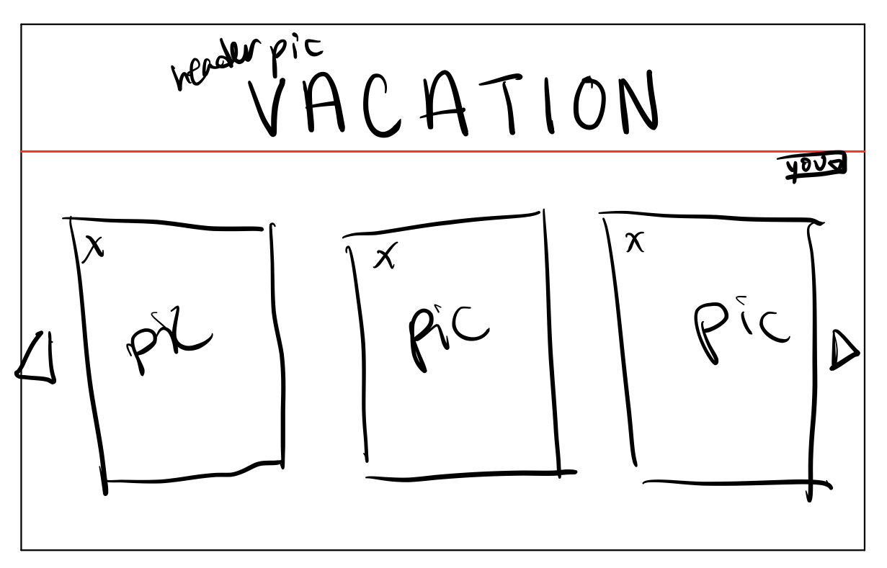
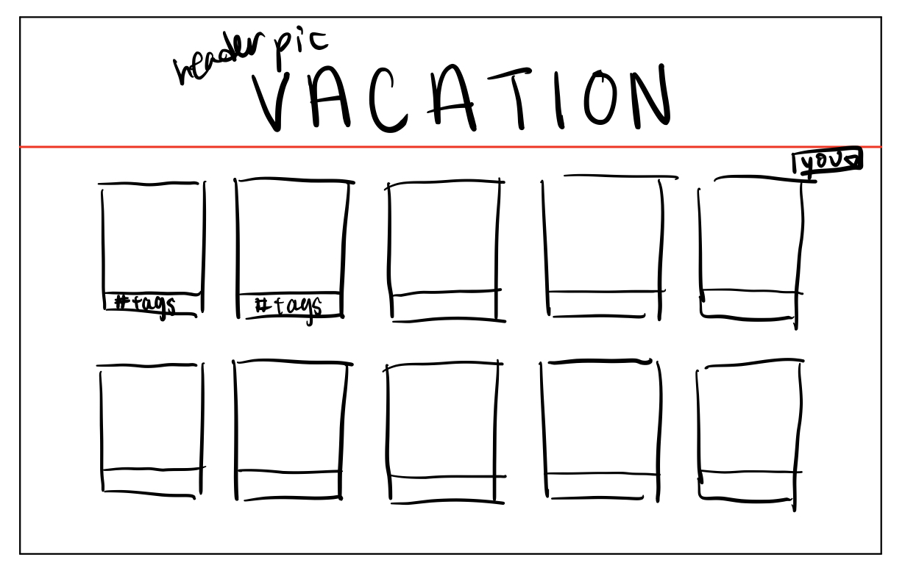
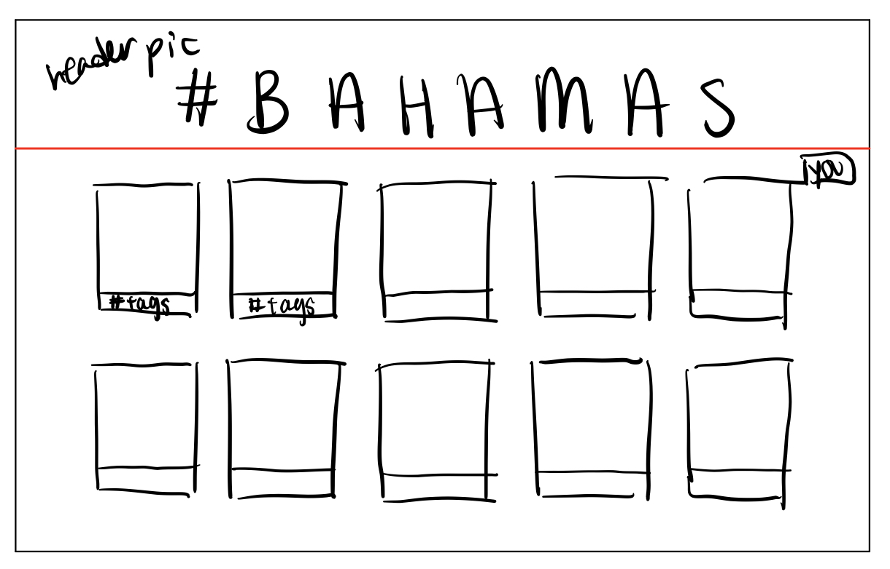
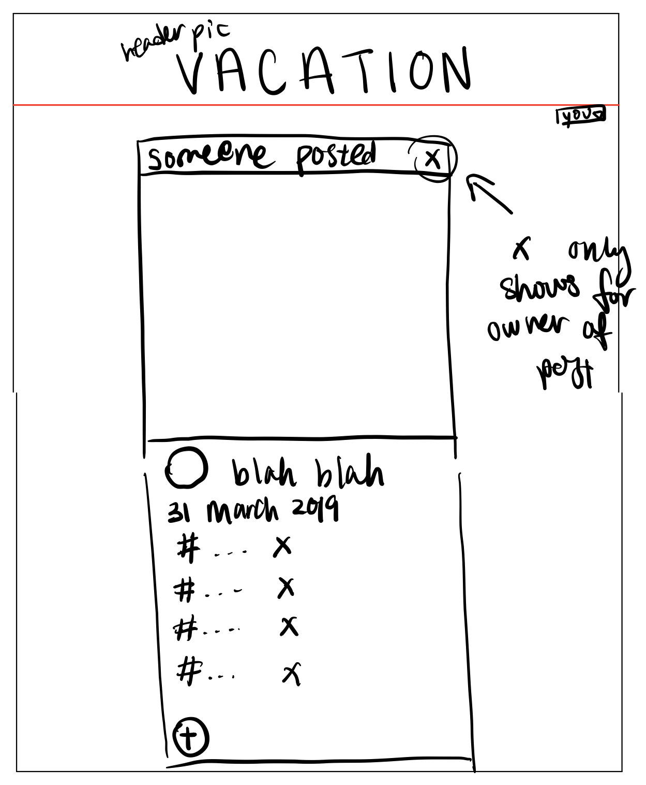
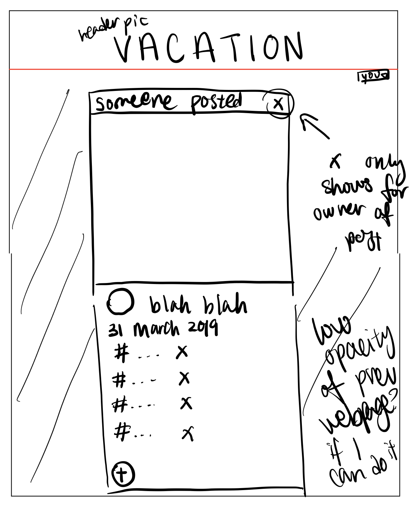

# Project 3: Design Journey

Your Name: [insert your name here]

**All images must be visible in Markdown Preview. No credit will be provided for images in your repository that are not properly linked in Markdown. Assume all file paths are case sensitive!**


# Project 3, Milestone 1 - Design, Plan, & Draft Website

## Describe your Gallery

[What will your gallery be about? 1 sentence.]
vacation pictures

## Target Audiences

[Tell us about your target two audiences. ~1-3 sentences per audience]
the site will be for people who are going/been on vacation and want to post their pictures, and people who are looking to go on vacation and want to see what each location or type of vacation is like.

## Design Process

[Document your design process. Show us the evolution of your design from your first idea (sketch) to design you wish to implement (sketch). Show us the process you used to organize content and plan the navigation (e.g. card sorting).]

[Label all images. All labels must be visible in Markdown Preview.]

The home page is just a log in screen that asks the user to log in or just continue anonymously. It follows previous designs where the background is some big scenic picture. Maybe it will be a random picture, from the uploaded pictures. Maybe.


Update: ended up being nearly identical to the plan

This is the page we land on at first. It is just all the pictures uploaded. I first considered doing a slideshow-like format gallery with arrow keys.

But then I thought that was way too tedious and annoying to do and that it would be much better if you could just see and scroll thru all the pictures that were smaller and in rows and columns.


Update: no template and other extra things. Extra things will only show when you click on the picture itself. Also we had to have all tags displayed so I put that in there as well. Otherwise, nearly identical

Each picture also has tags on the bottom of it. When you click on a tag, it brings you to a page like this that is much like the vacation page, except with the tag in the header and all the pictures having this particular tag.

Update: pretty much the same

As for when you click on a picture, you are brought to a page of just that particular picture, with who posted it, the date maybe, a description maybe, and all the tags listed out underneath the picture.

I thought it would be nice to, instead of bringing you to a separate page, and then you having to click the back arrow but to lose your spot in your scrolling, to make the page sort of like a pop up on the screen. Not a pop up, more of like, it pauses the current screen you're on and puts a lower opacity page on it with the single picture page. And then if you click out of that page you can go back to where you were without interruption. Though I'm not sure if this is beyond my ability...


Update: brings you to a new page. much simpler  format, though I kept the plan that certain functionality only appear if you are the uploader. I left out date and someone posted. The add and delete tags is also much more complex in the form of forms.

## Final Design Plan

[Include sketches of your final design here.]


## Templates

[Identify the templates you will use on your site.]
header for tags, all pictures, and single pictures.
maybe a template of the picture format? with the tags and description and things like that

## Database Schema Design

[Describe the structure of your database. You may use words or a picture. A bulleted list is probably the simplest way to do this. Make sure you include constraints for each field.]

[Hint: You probably need `users`, `images`, `tags`, and `image_tags` tables.]

[Hint: For foreign keys, use the singular name of the table + _id. For example: 1) `user_id` in the `images` table or 2) `image_id` and `tag_id` for the `image_tags` table.]

```
CREATE TABLE users (
	id INTEGER NOT NULL PRIMARY KEY AUTOINCREMENT UNIQUE,
	username TEXT NOT NULL UNIQUE,
	password TEXT NOT NULL
);

CREATE TABLE sessions (
	id INTEGER NOT NULL PRIMARY KEY AUTOINCREMENT UNIQUE,
	user_id INTEGER NOT NULL,
	session TEXT NOT NULL UNIQUE
);

CREATE TABLE documents (
	id INTEGER NOT NULL PRIMARY KEY AUTOINCREMENT UNIQUE,
	user_id INTEGER NOT NULL,
	file_name TEXT NOT NULL,
	file_ext TEXT NOT NULL,
	description TEXT
);

-- documents seed data
INSERT INTO documents (id, user_id, file_name, file_ext, description) VALUES (1, 1, 'beachmermaid.jpg', 'jpg', 'Sand mermaid <3');
INSERT INTO documents (id, user_id, file_name, file_ext, description) VALUES (2, 2, 'shooting.jpg', 'jpg', 'Fun times in Disneys Buzz Lightyear ride');
INSERT INTO documents (id, user_id, file_name, file_ext, description) VALUES (3, 1, 'selfie1.jpg', 'jpg', 'Bad selfie gud times');
INSERT INTO documents (id, user_id, file_name, file_ext, description) VALUES (4, 1, 'atlantis.jpg', 'jpg', 'Atlantis waterpark in Bahamas');
INSERT INTO documents (id, user_id, file_name, file_ext, description) VALUES (5, 1, 'disneygroup.jpg', 'jpg', 'Group picture at Disneyworld!');
INSERT INTO documents (id, user_id, file_name, file_ext, description) VALUES (6, 3, 'cruiseship.jpg', 'jpg', 'Sunset on Norwegian Escape cruise ship');
INSERT INTO documents (id, user_id, file_name, file_ext, description) VALUES (7, 2, 'bahamsgroup.jpg', 'jpg', 'We tried to do sorority squats');
INSERT INTO documents (id, user_id, file_name, file_ext, description) VALUES (8, 3, 'fish.jpg', 'jpg', 'Fish at the Atlantis Aquarium in Bahamas');
INSERT INTO documents (id, user_id, file_name, file_ext, description) VALUES (9, 2, 'selfie2.jpg', 'jpg', 'Selfie at Atlantis');
INSERT INTO documents (id, user_id, file_name, file_ext, description) VALUES (10, 1, 'sandcastle.jpg', 'jpg', 'It looks more like a big mound of sand');

CREATE TABLE tags (
	id INTEGER NOT NULL PRIMARY KEY AUTOINCREMENT UNIQUE,
	name TEXT NOT NULL UNIQUE
);

-- tags seed data
INSERT INTO tags (id, name) VALUES (1, 'bahamas');
INSERT INTO tags (id, name) VALUES (2, 'cruise');
INSERT INTO tags (id, name) VALUES (3, 'spring break');
INSERT INTO tags (id, name) VALUES (4, 'selfie');
INSERT INTO tags (id, name) VALUES (5, 'disneyworld');
INSERT INTO tags (id, name) VALUES (6, 'beach');

CREATE TABLE doc_tags (
	id INTEGER NOT NULL PRIMARY KEY AUTOINCREMENT UNIQUE,
	doc_id INTEGER NOT NULL,
	tag_id INTEGER NOT NULL
);

-- tags seed data
INSERT INTO doc_tags (id, doc_id, tag_id) VALUES (1, 1,1);
INSERT INTO doc_tags (id, doc_id, tag_id) VALUES (2, 1,6);
INSERT INTO doc_tags (id, doc_id, tag_id) VALUES (3, 1,3);
INSERT INTO doc_tags (id, doc_id, tag_id) VALUES (4, 2,5);
INSERT INTO doc_tags (id, doc_id, tag_id) VALUES (5, 3,4);
INSERT INTO doc_tags (id, doc_id, tag_id) VALUES (6, 3,3);

```


## Code Planning

[Plan what top level PHP pages you'll need.]


[Plan what templates you'll need.]
header,login

[Plan any PHP code you'll need.]

Example:
```
function is_user_logged_in() {
  if user is logged in, return true
  otherwise, return false
}

// Show logout, only if user is logged in.
if user is logged in (is_user_logged_in()) then
  show logout link
else
  show login link
end
```
HEADER:
```
<header>
  <h1 id="title" class="white"><?php

  if ((strpos($_SERVER['PHP_SELF'], 'vacation.php')!==false) || (strpos($_SERVER['PHP_SELF'], 'upload.php')!==false)){
    echo $header_title;
  }
  else{
  echo "photo";}
  ?></h1>

  <nav id="menu">
    <ul>
      <?php
      foreach( $pages as $page ) {
        if($page[0] != "index.php"){
          $file = $page[0];
          $name = $page[1];

          echo '<li';
          if ($current_file == $file) {
            echo ' class=\'current_page\'';
          }
          echo '><a href="' . $file . '">' . $name . '</a></li>';
        }
    }

      if ( is_user_logged_in() ) {
        // Add a logout query string parameter
        $logout_url = htmlspecialchars( $_SERVER['PHP_SELF'] ) . '?' . http_build_query( array( 'logout' => '' ) );

        echo '<li id="nav-last"><a href="' . $logout_url . '">Sign Out ' . htmlspecialchars($current_user['username']) . '</a></li>';
      }
      else{
        echo '<li id="nav-last"><a href="index.php">Sign In </a></li>';
      }
      ?>
    </ul>
  </nav>
</header>

```
PART OF UPLOAD:
```
if ( isset($_POST["submit_upload"]) && is_user_logged_in() ) {

  // get the info about the uploaded files.
  $upload_info = $_FILES["upload_file"];
  $upload_desc = filter_input(INPUT_POST, 'description', FILTER_SANITIZE_STRING);

  if ( $upload_info['error'] == UPLOAD_ERR_OK ) {
    $upload_name = basename($upload_info["name"]);
    $upload_ext = strtolower( pathinfo($upload_name, PATHINFO_EXTENSION) );

    $sql = "INSERT INTO documents (user_id, file_name, file_ext, description) VALUES (:user_id, :filename, :extension, :description)";
    $params = array(
      ':user_id' => $current_user['id'],
      ':filename' => $upload_name,
      ':extension' => $upload_ext,
      ':description' => $upload_desc,
    );
```
PRINTING ALL PICTURES OUT IN VACATION.PHP
```
$sql = "SELECT * FROM tags";
  $all_tags = exec_sql_query($db, $sql)->fetchAll();

        echo '<div class=\'center padtop\'>';
        echo '<a class=\'biggerfont\' href=vacation.php> all photos </a>' . PHP_EOL;
        echo '  ★  ';
        foreach($all_tags as $tag){
          echo '<a class=\'biggerfont\' href="vacation.php?' . http_build_query(array('tag' => $tag['id'])) . '"> #' . $tag['name'] . '</a>' . PHP_EOL;
          echo '  ★  ';
          }
        echo '</div>';
```

## Database Query Plan

[Plan your database queries. You may use natural language, pseudocode, or SQL.]

ALL DOCS
```
  $sql = "SELECT * FROM documents WHERE id = :id;";
```
DELETING POST
```
 $sql = "DELETE FROM documents WHERE id = $id";
 ```
 SELECT ALL TAGS FROM PHOTO
 ```
$sql = "SELECT doc_tags.tag_id FROM doc_tags WHERE (doc_id = :doc_id AND tag_id = :tag_id);";
$sql = "SELECT tags.id, tags.name FROM doc_tags INNER JOIN tags ON doc_tags.tag_id = tags.id WHERE doc_tags.doc_id = :image_id;";
 ```
 ALL TAG NAMES
  ```
     $sql = "SELECT tags.name FROM tags WHERE tags.id = :tagid;";
 ```
 ALL PHOTOS FOR A TAG
 ```
 $sql = "SELECT documents.id, documents.file_ext FROM documents INNER JOIN doc_tags ON doc_tags.doc_id = documents.id WHERE doc_tags.tag_id = :tag_id;";
```

# Project 3, Milestone 2 - Gallery and User Access Controls

## Issues & Challenges

[Tell us about any issues or challenges you faced while trying to complete milestone 2. 2-4 sentences/bullet points]
-not sure how to do login implementation by myself
-unsure of how to do the single image page (how to do that with a template?)
-unsure of how to make the login a template across all pages without having the form tacked on everywhere

# Final Submission: Complete & Polished Website

## Reflection

[Take this time to reflect on what you learned during this assignment. How have you improved since starting this class? 2-4 sentences]
I definitely understand how to use SQL better and how tables and join actually works. When I did Lab7 I felt like I had no idea but now I think I understand. I also understand how global variables and functions in init can be used everywhere for easy access, and also how you can use variables across pages for dynamic programming. I feel like I'm better at SQL querying and query strings in the URL and using them to advantage to get the information needed. I think I'm also better at writing up forms.
